# 🏗️ Churn Prediction MLOps System Architecture

## 📋 Table of Contents
- [System Overview](#system-overview)
- [High-Level Architecture](#high-level-architecture)
- [Component Architecture](#component-architecture)
- [Data Flow Architecture](#data-flow-architecture)
- [Deployment Architecture](#deployment-architecture)
- [CI/CD Pipeline](#cicd-pipeline)
- [Monitoring Architecture](#monitoring-architecture)
- [API Architecture](#api-architecture)
- [Security Architecture](#security-architecture)
- [Scalability Considerations](#scalability-considerations)

## 🎯 System Overview

The Churn Prediction MLOps System is an end-to-end machine learning pipeline designed to predict customer churn with production-grade reliability, monitoring, and scalability. The system follows MLOps best practices with automated training, deployment, and monitoring capabilities.

### Key Capabilities
- **Real-time Predictions**: FastAPI-based REST API for instant churn predictions
- **Model Management**: Automated training, versioning, and deployment of ML models
- **Monitoring & Observability**: Comprehensive metrics collection with Prometheus and Grafana
- **Containerized Deployment**: Docker-based deployment with orchestration
- **CI/CD Integration**: Automated testing and deployment pipeline
- **Scalable Architecture**: Microservices-based design for horizontal scaling

## 🏛️ High-Level Architecture

```mermaid
graph TB
    subgraph "External"
        Client[👤 Client Applications]
        Data[📊 Customer Data Source]
        Git[🔄 Git Repository]
    end
    
    subgraph "MLOps Platform"
        subgraph "Development Layer"
            Jupyter[📓 Jupyter Notebooks]
            Training[🧠 Model Training]
            Experiments[🔬 MLflow Experiments]
        end
        
        subgraph "API Layer"
            FastAPI[⚡ FastAPI Service]
            Models[🤖 Model Registry]
            Validation[✅ Data Validation]
        end
        
        subgraph "Infrastructure Layer"
            Docker[🐳 Docker Containers]
            Prometheus[📊 Prometheus]
            Grafana[📈 Grafana]
        end
        
        subgraph "CI/CD Layer"
            Actions[🚀 GitHub Actions]
            Tests[🧪 Automated Tests]
            Deploy[📦 Deployment]
        end
    end
    
    Client --> FastAPI
    Data --> Training
    Git --> Actions
    Training --> Models
    FastAPI --> Models
    FastAPI --> Prometheus
    Prometheus --> Grafana
    Actions --> Deploy
    Deploy --> Docker
```

## 🔧 Component Architecture

### Core Components Breakdown

```mermaid
graph LR
    subgraph "Data Processing"
        Raw[📥 Raw Data]
        Clean[🧹 Data Cleaning]
        Feature[⚙️ Feature Engineering]
        Split[📊 Train/Test Split]
    end
    
    subgraph "Model Development"
        LR[📈 Logistic Regression]
        RF[🌳 Random Forest]
        Eval[📋 Model Evaluation]
        Select[🏆 Best Model Selection]
    end
    
    subgraph "Model Serving"
        Pipeline[🔄 ML Pipeline]
        API[🌐 REST API]
        Predict[🎯 Prediction Service]
    end
    
    subgraph "Monitoring"
        Metrics[📊 Performance Metrics]
        Logs[📝 Application Logs]
        Health[💚 Health Checks]
    end
    
    Raw --> Clean
    Clean --> Feature
    Feature --> Split
    Split --> LR
    Split --> RF
    LR --> Eval
    RF --> Eval
    Eval --> Select
    Select --> Pipeline
    Pipeline --> API
    API --> Predict
    API --> Metrics
    API --> Logs
    API --> Health
```

### Technology Stack

| Layer | Technology | Purpose |
|-------|------------|---------|
| **API Framework** | FastAPI | High-performance async web framework |
| **ML Framework** | Scikit-learn | Model training and preprocessing |
| **Data Processing** | Pandas, NumPy | Data manipulation and analysis |
| **Model Serialization** | Joblib | Model persistence and loading |
| **Containerization** | Docker | Application packaging and deployment |
| **Orchestration** | Docker Compose | Multi-container application management |
| **Monitoring** | Prometheus | Metrics collection and storage |
| **Visualization** | Grafana | Metrics dashboards and alerting |
| **Experiment Tracking** | MLflow | Model versioning and experiment management |
| **CI/CD** | GitHub Actions | Automated testing and deployment |
| **Data Validation** | Pydantic | Request/response schema validation |

## 🌊 Data Flow Architecture

### Training Pipeline Data Flow

```mermaid
flowchart TD
    Start([🚀 Start Training]) --> Load[📂 Load Customer Data]
    Load --> Validate{✅ Data Valid?}
    Validate -->|No| Error[❌ Data Error]
    Validate -->|Yes| Clean[🧹 Data Cleaning]
    
    Clean --> Engineer[⚙️ Feature Engineering]
    Engineer --> Split[📊 Train/Test Split]
    
    Split --> TrainLR[📈 Train Logistic Regression]
    Split --> TrainRF[🌳 Train Random Forest]
    
    TrainLR --> EvalLR[📊 Evaluate LR]
    TrainRF --> EvalRF[📊 Evaluate RF]
    
    EvalLR --> Compare[🔍 Compare Models]
    EvalRF --> Compare
    
    Compare --> Select[🏆 Select Best Model]
    Select --> Save[💾 Save Model Artifacts]
    
    Save --> Plots[📊 Generate Visualizations]
    Plots --> End([✅ Training Complete])
    
    Error --> End
```

### Prediction Pipeline Data Flow

```mermaid
flowchart TD
    Request[📱 Client Request] --> Validate{✅ Input Valid?}
    Validate -->|No| BadRequest[❌ 400 Bad Request]
    Validate -->|Yes| Load[📂 Load Model]
    
    Load --> Transform[🔄 Feature Transformation]
    Transform --> Predict[🎯 Generate Prediction]
    
    Predict --> Probability[📊 Calculate Probability]
    Probability --> Threshold{🎚️ Prob >= 0.5?}
    
    Threshold -->|Yes| ChurnTrue[✅ Churn: True]
    Threshold -->|No| ChurnFalse[❌ Churn: False]
    
    ChurnTrue --> Response[📤 JSON Response]
    ChurnFalse --> Response
    
    Response --> Metrics[📊 Update Metrics]
    Metrics --> Log[📝 Log Request]
    Log --> End([✅ Complete])
    
    BadRequest --> End
```

## 🚀 Deployment Architecture

### Docker Compose Services

```mermaid
graph TB
    subgraph "Docker Host"
        subgraph "churn-network"
            subgraph "App Container"
                FastAPI[⚡ FastAPI App<br/>Port: 8000]
                Models[🤖 Model Files]
                Code[💻 Application Code]
            end
            
            subgraph "Prometheus Container"
                PromServer[📊 Prometheus Server<br/>Port: 9090]
                PromConfig[⚙️ prometheus.yml]
                PromData[💾 Metrics Data]
            end
            
            subgraph "Grafana Container"
                GrafanaUI[📈 Grafana UI<br/>Port: 3000]
                GrafanaData[💾 Dashboard Data]
                GrafanaConfig[⚙️ Configuration]
            end
        end
        
        subgraph "Volumes"
            ModelVol[📁 ./models]
            AppVol[📁 ./app]
            GrafanaVol[📁 grafana-storage]
        end
    end
    
    subgraph "External Access"
        User[👤 User] 
        Admin[👨‍💼 Admin]
        Monitor[👀 Monitoring]
    end
    
    User -->|HTTP:8000| FastAPI
    Admin -->|HTTP:3000| GrafanaUI
    Monitor -->|HTTP:9090| PromServer
    
    FastAPI -.->|Scrape| PromServer
    GrafanaUI -.->|Query| PromServer
    
    ModelVol --> Models
    AppVol --> Code
    GrafanaVol --> GrafanaData
```

### Container Specifications

| Container | Base Image | Ports | Volumes | Purpose |
|-----------|------------|-------|---------|---------|
| **app** | `python:3.9-slim` | 8000:8000 | `./app`, `./models` | ML API service |
| **prometheus** | `prom/prometheus` | 9090:9090 | `./prometheus.yml` | Metrics collection |
| **grafana** | `grafana/grafana` | 3000:3000 | `grafana-storage` | Metrics visualization |

## 🔄 CI/CD Pipeline

### GitHub Actions Workflow

```mermaid
flowchart TD
    subgraph "Triggers"
        Push[📝 Code Push]
        PR[🔀 Pull Request]
    end
    
    subgraph "CI Pipeline"
        Checkout[📥 Checkout Code]
        Setup[🐍 Setup Python]
        Install[📦 Install Dependencies]
        Lint[🔍 Code Linting]
        Test[🧪 Run Tests]
        Build[🏗️ Build Docker Image]
    end
    
    subgraph "CD Pipeline"
        Security[🔒 Security Scan]
        Push_Image[📤 Push to Registry]
        Deploy_Staging[🚀 Deploy to Staging]
        Integration_Test[🔧 Integration Tests]
        Deploy_Prod[🌟 Deploy to Production]
    end
    
    subgraph "Post-Deployment"
        Monitor[📊 Health Monitoring]
        Rollback{🔄 Rollback Needed?}
        Notify[📧 Notifications]
    end
    
    Push --> Checkout
    PR --> Checkout
    
    Checkout --> Setup
    Setup --> Install
    Install --> Lint
    Lint --> Test
    Test --> Build
    
    Build --> Security
    Security --> Push_Image
    Push_Image --> Deploy_Staging
    Deploy_Staging --> Integration_Test
    Integration_Test --> Deploy_Prod
    
    Deploy_Prod --> Monitor
    Monitor --> Rollback
    Rollback -->|Yes| Deploy_Staging
    Rollback -->|No| Notify
```

### Current Implementation Status

| Stage | Status | Implementation |
|-------|--------|----------------|
| **Basic CI** | ✅ Implemented | Checkout + Echo test |
| **Testing** | ⚠️ Planned | pytest integration needed |
| **Linting** | ⚠️ Planned | flake8, black integration |
| **Docker Build** | ⚠️ Planned | Multi-stage build |
| **Security Scan** | ❌ Not Planned | Container vulnerability scanning |
| **Deployment** | ❌ Not Planned | Automated deployment |

## 📊 Monitoring Architecture

### Metrics Collection Flow

```mermaid
flowchart LR
    subgraph "Application Layer"
        API[⚡ FastAPI App]
        Instrumentator[🔧 Prometheus<br/>Instrumentator]
        Metrics_Endpoint[📊 /metrics]
    end
    
    subgraph "Collection Layer"
        Prometheus[📈 Prometheus Server]
        Scraper[🔄 Metrics Scraper]
        TSDB[(🗄️ Time Series DB)]
    end
    
    subgraph "Visualization Layer"
        Grafana[📊 Grafana]
        Dashboards[📋 Dashboards]
        Alerts[🚨 Alerts]
    end
    
    subgraph "Metrics Types"
        HTTP[🌐 HTTP Metrics]
        Custom[⚙️ Custom Metrics]
        System[💻 System Metrics]
    end
    
    API --> Instrumentator
    Instrumentator --> Metrics_Endpoint
    Instrumentator --> HTTP
    Instrumentator --> Custom
    
    Scraper -->|15s interval| Metrics_Endpoint
    Scraper --> Prometheus
    Prometheus --> TSDB
    
    Grafana -->|PromQL| Prometheus
    Grafana --> Dashboards
    Grafana --> Alerts
    
    System --> Prometheus
```

### Key Metrics Monitored

| Metric Category | Metrics | Purpose |
|----------------|---------|---------|
| **HTTP Metrics** | Request rate, Response time, Status codes | API performance monitoring |
| **ML Metrics** | Prediction latency, Model accuracy, Inference count | Model performance tracking |
| **System Metrics** | CPU usage, Memory usage, Disk I/O | Resource utilization |
| **Business Metrics** | Churn predictions, Customer segments | Business KPI tracking |

## 🌐 API Architecture

### FastAPI Endpoint Structure

```mermaid
graph TD
    subgraph "FastAPI Application"
        Router[🛣️ Main Router]
        
        subgraph "Endpoints"
            Root[🏠 GET /]
            Predict[🎯 POST /predict]
            Health[💚 GET /health]
            Metrics[📊 GET /metrics]
            Docs[📚 GET /docs]
        end
        
        subgraph "Middleware"
            CORS[🔗 CORS Middleware]
            Logging[📝 Logging Middleware]
            Prometheus_Mid[📊 Prometheus Middleware]
        end
        
        subgraph "Dependencies"
            Model[🤖 ML Model]
            Validator[✅ Pydantic Schemas]
            Logger[📋 Logger Instance]
        end
    end
    
    Router --> Root
    Router --> Predict
    Router --> Health
    Router --> Metrics
    Router --> Docs
    
    Router --> CORS
    Router --> Logging
    Router --> Prometheus_Mid
    
    Predict --> Model
    Predict --> Validator
    Predict --> Logger
```

### Request/Response Flow

## 🔒 Security Architecture

### Current Security Measures

```mermaid
graph TB
    subgraph "Security Layers"
        subgraph "Application Security"
            Input_Val[✅ Input Validation]
            Pydantic[🛡️ Pydantic Schemas]
            Error_Handle[⚠️ Error Handling]
        end
        
        subgraph "Infrastructure Security"
            Docker_Sec[🐳 Docker Security]
            Network_Iso[🔒 Network Isolation]
            Volume_Mount[📁 Volume Restrictions]
        end
        
        subgraph "Monitoring Security"
            Access_Log[📝 Access Logging]
            Health_Check[💚 Health Monitoring]
            Metrics_Sec[📊 Metrics Security]
        end
    end
    
    subgraph "Recommended Enhancements"
        Auth[🔐 Authentication]
        Rate_Limit[⏱️ Rate Limiting]
        HTTPS[🔒 HTTPS/TLS]
        Secrets[🔑 Secret Management]
        Scanning[🔍 Vulnerability Scanning]
    end
    
    Input_Val --> Pydantic
    Docker_Sec --> Network_Iso
    Access_Log --> Health_Check
    
    style Auth fill:#ffcccc
    style Rate_Limit fill:#ffcccc
    style HTTPS fill:#ffcccc
    style Secrets fill:#ffcccc
    style Scanning fill:#ffcccc
```

### Security Recommendations

| Priority | Enhancement | Implementation |
|----------|-------------|----------------|
| **High** | HTTPS/TLS | Reverse proxy with SSL certificates |
| **High** | Authentication | JWT tokens or API keys |
| **Medium** | Rate Limiting | FastAPI rate limiting middleware |
| **Medium** | Secret Management | Environment variables + vault |
| **Low** | Input Sanitization | Additional validation layers |

## 📈 Scalability Considerations

### Horizontal Scaling Architecture

```mermaid
graph TB
    subgraph "Load Balancer"
        LB[⚖️ Load Balancer<br/>NGINX/HAProxy]
    end
    
    subgraph "API Tier"
        API1[⚡ FastAPI Instance 1]
        API2[⚡ FastAPI Instance 2]
        API3[⚡ FastAPI Instance 3]
    end
    
    subgraph "Model Storage"
        ModelStore[🤖 Shared Model Storage<br/>S3/NFS]
    end
    
    subgraph "Monitoring"
        PromCluster[📊 Prometheus Cluster]
        GrafanaCluster[📈 Grafana Cluster]
    end
    
    subgraph "Data Layer"
        ModelRegistry[📚 Model Registry<br/>MLflow]
        MetricsDB[(📊 Metrics Database)]
        LogStore[📝 Centralized Logging<br/>ELK Stack]
    end
    
    LB --> API1
    LB --> API2
    LB --> API3
    
    API1 --> ModelStore
    API2 --> ModelStore
    API3 --> ModelStore
    
    API1 --> PromCluster
    API2 --> PromCluster
    API3 --> PromCluster
    
    PromCluster --> MetricsDB
    GrafanaCluster --> PromCluster
    
    API1 --> LogStore
    API2 --> LogStore
    API3 --> LogStore
    
    ModelStore --> ModelRegistry
```

### Performance Optimization Strategies

| Component | Current State | Optimization Strategy |
|-----------|---------------|---------------------|
| **API Response** | ~100ms | Async processing, model caching |
| **Model Loading** | On startup | Lazy loading, model warming |
| **Data Processing** | Synchronous | Async pandas operations |
| **Monitoring** | Basic metrics | Custom business metrics |
| **Deployment** | Single container | Container orchestration (K8s) |

## 🎯 Future Enhancements

### Roadmap

### Technical Debt & Improvements

| Category | Current Gap | Recommended Solution |
|----------|-------------|---------------------|
| **Testing** | No unit tests | Implement pytest suite with >80% coverage |
| **Model Management** | Manual model updates | Automated retraining pipeline |
| **Data Pipeline** | Static dataset | Real-time data ingestion |
| **Feature Store** | No feature management | Implement feature store (Feast) |
| **Model Versioning** | Basic joblib save | Full MLflow integration |
| **Alerting** | No alerting | Grafana alerts + PagerDuty integration |

---

## 📚 Additional Resources

### Documentation Links
- [FastAPI Documentation](https://fastapi.tiangolo.com/)
- [Prometheus Documentation](https://prometheus.io/docs/)
- [Grafana Documentation](https://grafana.com/docs/)
- [MLflow Documentation](https://mlflow.org/docs/)
- [Docker Compose Documentation](https://docs.docker.com/compose/)

### Best Practices References
- [MLOps Best Practices](https://ml-ops.org/)
- [Twelve-Factor App](https://12factor.net/)
- [Container Security Best Practices](https://sysdig.com/blog/dockerfile-best-practices/)
- [API Security Best Practices](https://owasp.org/www-project-api-security/)

---

*This architecture documentation is a living document and should be updated as the system evolves.* 